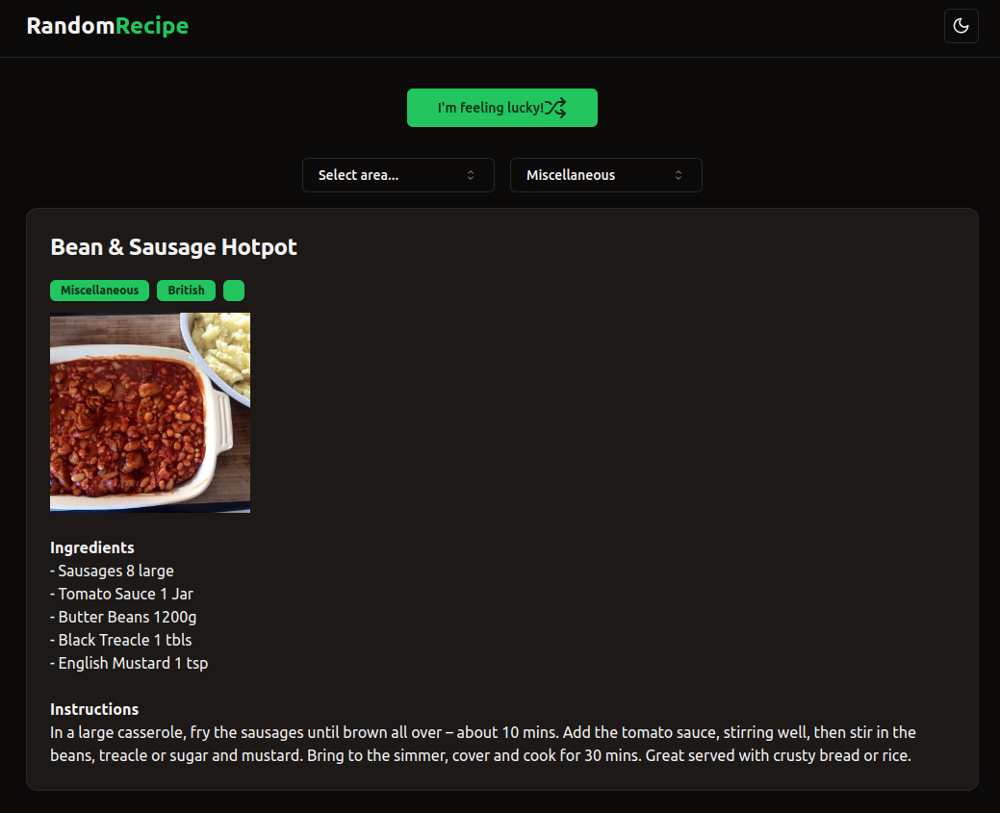

# RandomRecipe

Quick 2 hour coding challenge for a job interview.

**The specs were as follows:**

- The application should have a user interface where users can click on a button to display random recipes.
- The recipes should come from a predefined list of dishes or foods. You can use an API to retrieve the recipes or provide a static list of recipes in the application.
- Each recipe should contain a preview image, the name of the dish, the list of ingredients, and a step-by-step guide to preparation.
- Implement a filter function that allows users to search for specific criteria, such as cuisine type (e.g. Italian, Chinese, Mexican), difficulty level, or main ingredient.
- The application should be responsive and work well on different screen sizes.
- Use HTML, CSS, and TypeScript for the frontend development. You can use a JavaScript library or framework such as React, Vue.js, or Angular.
- If you use an API to retrieve recipes, you may need to use AJAX or Fetch API requests.

## Technologies Used

- React
- TypeScript
- TailwindCSS
- Tanstack React Query
- shadcn/ui
- Vite

## How to run

1. Clone the repository
2. Run `npm install` to install the dependencies
3. Run `npm run dev` to start the development server

## Screenshot

